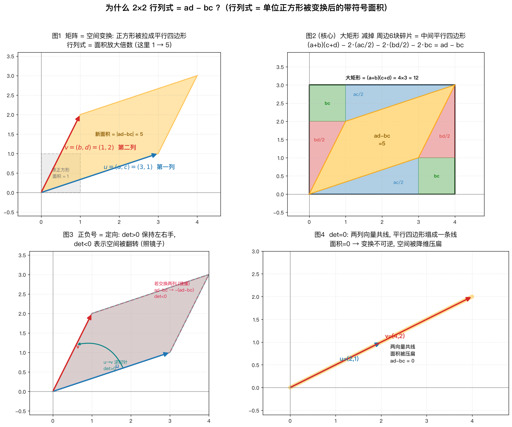

# 为什么 2×2 行列式 = ad − bc?

配套代码 `det_explain.py`,运行后生成 `det_explain.png`(四张图)。

```bash
# 依赖通过 PEP 723 内联元数据声明, uv 会自动装好, 无需手动建 venv
uv run det_explain.py
# 若 uv 拉取 PyPI 报证书错误, 加 --native-tls: uv run --native-tls det_explain.py
```

矩阵

```
A = | a  b |      本文用具体数字 a=3, b=1, c=1, d=2
    | c  d |      det = ad - bc = 3·2 - 1·1 = 5
```

---

## 一句话直觉

> 把矩阵看成一个**空间变换**,行列式就是它把**面积放大/缩小的倍数**。
> 单位正方形(面积=1)被 A 拉成一个平行四边形,这个平行四边形的**带符号面积**就是 `ad − bc`。

矩阵的两列 `u=(a,c)`、`v=(b,d)`,正是"单位正方形的两条边被变换后落到哪里"。面积怎么变,行列式就是几。

---

## 四张图串起来



### 图1 · 变换在做什么?

单位正方形经过 A,变成由 `u`、`v` 张成的平行四边形。面积从 `1` 变成 `5`——**行列式 = 面积放大倍数**。这一步只是把"行列式是什么"这件事画出来,还没解释为什么偏偏是 `ad − bc`。

### 图2(核心)· ad − bc 从哪来?

把平行四边形塞进一个 `(a+b) × (c+d)` 的大矩形里,然后**大矩形减掉周边 6 块碎片,剩下的就是平行四边形**:

```
大矩形  (a+b)(c+d) = 4×3      = 12
 − 2 个 ac/2 三角形（蓝）      = 3
 − 2 个 bd/2 三角形（红）      = 2
 − 2 个 bc  小矩形（绿）       = 2
 ─────────────────────────────────
 平行四边形                    = 5   =  ad − bc   ✓
```

代数展开正好对上:

$$
(a+b)(c+d) - 2\cdot\tfrac{ac}{2} - 2\cdot\tfrac{bd}{2} - 2bc
= (ac+ad+bc+bd) - ac - bd - 2bc = ad - bc
$$

图里这 6 块碎片是**严丝合缝的拼图**:平行四边形只碰到大矩形的左下角 `(0,0)` 和右上角 `(a+b, c+d)`,剩下的空间被上下两条边切成中心对称的两半,每半都是「三角形 `ac/2` + 矩形 `bc` + 三角形 `bd/2`」。填满、无缝隙、不重叠——所以你能**直接看出** `ad − bc` 是怎么剩下来的。

> **类比**:`ad − bc` 就像"毛面积 − 边角料"。大矩形是能圈住的最大地块,平行四边形是真正属于这次变换的地,周围 6 块是切掉的边角料。

### 图3 · 负号是什么意思?

`ad − bc` 是**带符号**面积:

| 情况 | 几何含义 |
|---|---|
| `det > 0` | 从 `u` 转到 `v` 是逆时针,**定向保持**(左右手不变) |
| `det < 0` | 交换两列 = 照镜子,**空间被翻转**,面积取负 |

所以行列式不仅告诉你面积缩放几倍,还告诉你空间有没有被"翻面"。

### 图4 · det = 0 呢?

当两列向量**共线**(比如 `u=(2,1)`、`v=(4,2)`),平行四边形被压扁成一条线,面积 = 0,`ad − bc = 0`。几何上意味着:**变换把二维空间压成了一维,信息丢失,矩阵不可逆**。这也是"行列式 = 0 ⇔ 矩阵不可逆"最直观的解释。

---

## 一句话总结

| 行列式的值 | 面积 | 定向 | 可逆性 |
|---|---|---|---|
| `ad − bc > 0` | 放大 \|ad−bc\| 倍 | 不翻转 | 可逆 |
| `ad − bc < 0` | 放大 \|ad−bc\| 倍 | 翻转（镜像） | 可逆 |
| `ad − bc = 0` | 压成 0 | —— | **不可逆** |

> **行列式 = 单位正方形被矩阵变换后的带符号面积**,而这块面积用"大矩形减边角料"一算,就是 `ad − bc`。
