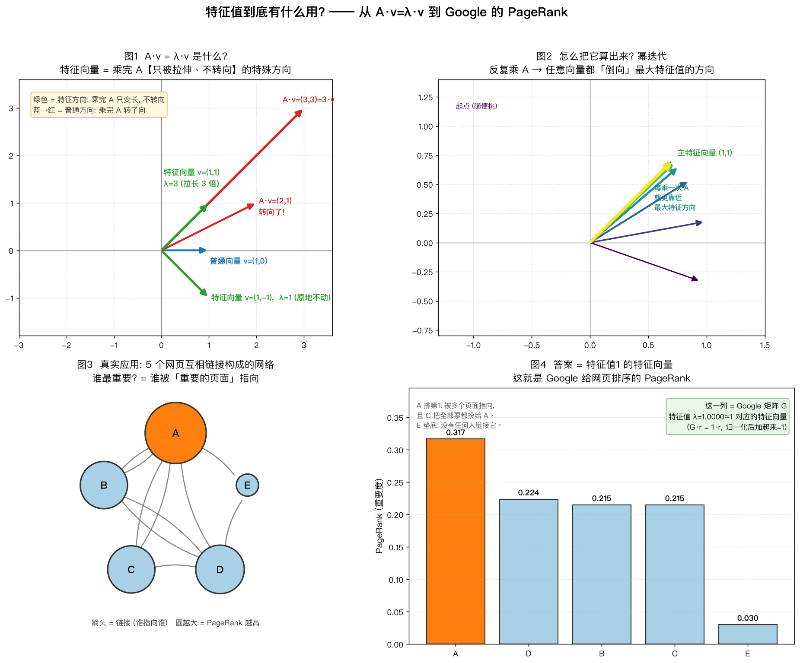

# 特征值到底有什么用? —— 从 A·v=λ·v 到 Google 的 PageRank

配套代码 `eigen_pagerank.py`,运行后生成 `eigen_pagerank.png`(四张图),并在终端把账算给你看。

```bash
# 依赖通过 PEP 723 内联元数据声明, uv 会自动装好, 无需手动建 venv
uv run eigen_pagerank.py
# 若 uv 拉取 PyPI 报证书错误, 加 --native-tls: uv run --native-tls eigen_pagerank.py
```

这个 demo 挑的是一个**真实的、改变世界的应用(不是玩具)**:Google 早期就是靠 PageRank 起家的,而 PageRank 的数学本质,就是一个矩阵的**特征向量**。

---

## 一句话直觉

> 拿一个矩阵 `A` 去乘一个向量 `v`,**大多数向量会既被拉伸、又被转向**。
> 但总有那么几个**特殊方向**,乘完之后**方向完全不变,只是长度变成了 λ 倍**。
> 这个特殊方向叫**特征向量**,那个倍数 λ 叫**特征值**。

$$
A\,v = \lambda\,v
$$

- **特征向量 `v`** 回答:这个特殊方向**是什么**。
- **特征值 `λ`** 回答:这个方向有**多重要 / 被放大多少倍**。

---

## 为什么拿 PageRank 举例?

因为它把"抽象的特征向量"变成了一个你天天在用的东西:**搜索结果的排序**。

把全世界的网页看成一张网:网页 = 节点,链接 = 箭头。一个网页"重要不重要",不能只数它有多少条入链,而要看**是不是被重要的网页指向**——这是一个"鸡生蛋、蛋生鸡"的循环定义。

Google 的做法:把"谁指向谁"写成一个矩阵 `G`,那么

> **每个网页的重要度 = 矩阵 `G` 里【特征值 = 1】那个特征向量。**

`G·r = 1·r` 的意思是:重要度向量 `r` 被这张网"传递一轮"之后,**还是它自己**——达到了稳定状态。这个稳定状态就是排名。

---

## 四张图串起来



### 图1 · A·v = λ·v 到底是什么?(概念)

用一个能手算的对称矩阵 `A = [[2,1],[1,2]]`:

| 向量 | A·v | 发生了什么 |
|---|---|---|
| 普通向量 `(1,0)` | `(2,1)` | **转向了** —— 不是特征向量 |
| 特征向量 `(1,1)` | `(3,3)` | 方向不变,长度 **×3** → **λ=3** |
| 特征向量 `(1,-1)` | `(1,-1)` | **纹丝不动** → **λ=1** |

绿色的两个方向就是特征向量:乘完 A **只变长、不转向**。这就是"特殊方向"的含义。

### 图2 · 怎么把它算出来?(幂迭代)

真实网页矩阵有几十亿维,不可能去解特征方程。工程上用的是**幂迭代**:

> 随便挑一个向量,反复乘 `A`(每步归一化),它会**自动"倒向"最大特征值对应的那个方向**。

图里那束由深到浅、逐渐"扇"向 `(1,1)` 的箭头,就是这个过程。**PageRank 就是这么算出来的**——不停地把重要度沿着链接传递,直到不再变化。

### 图3 · 真实的应用长啥样?(网络)

5 个网页 A~E,链接关系:

```
A → B, C, D      B → A, D      C → A      D → B, C      E → A, D
```

图里圆越大代表 PageRank 越高。注意几个真实网络的特点:

- **C 只指向 A** —— 它把自己全部的"投票权"都给了 A。
- **没有任何人链接 E** —— 它会垫底。

### 图4 · 答案是什么?(排名 = 特征向量)

对 Google 矩阵 `G` 求解 `G·r = 1·r`,得到的 `r`(归一化到和为 1)就是排名:

| 排名 | 网页 | PageRank | 为什么 |
|---|---|---|---|
| 1 | **A** | 0.317 | 被 B、C、E 多个页面指向,且 C 把全部票投给它 |
| 2 | D | 0.224 | 被 A、B、E 指向 |
| 3 | B | 0.215 | 被 A、D 指向 |
| 3 | C | 0.215 | 只有 A 指向它,但 A 很重要 |
| 5 | E | 0.030 | **没人链接它**,只剩随机跳转的最低保底 |

代码里用了**两种办法**互相印证,结果完全一致(差异 ~1e-16):

1. `np.linalg.eig` 直接特征分解,取 λ 最接近 1 的特征向量;
2. 幂迭代 `r = G·r` 迭代 100 次。

> 关键点:**A 排第一不是因为入链最多,而是因为链接它的页面本身重要**。这个"重要度会沿链接传递并达到稳定"的思想,正是特征向量 `G·r = r` 的含义。

---

## 一句话总结

| | 特征向量 `v` | 特征值 `λ` |
|---|---|---|
| 回答什么 | 这个特殊方向**是什么** | 这个方向**多重要 / 放大几倍** |
| 图1 (概念) | `(1,1)`、`(1,-1)` 这两个不转向的方向 | `3`、`1` |
| PageRank | 网页重要度的**排名向量** | `1`(稳定状态) |
| PCA / 金融风险 | 数据里的**主方向 / 风险因子** | 该方向解释的**方差 / 能量** |

> **特征向量 = 被矩阵"乘"过之后方向不变的特殊方向;特征值 = 它被放大的倍数。**
> 无论是 Google 排网页、PCA 降维,还是金融里分解风险,做的都是同一件事:**在一个复杂系统里,找出最重要的那几个方向。**

---

## 延伸:这套数学在别处长什么样

- **PageRank 的 `G·r = r`** 本质是马尔可夫链的**稳态分布**——同样的数学,在金融里就是"长期资金/风险会流向哪里"。
- 把矩阵换成**协方差矩阵**,最大特征值对应的特征向量就是 **PCA 的第一主成分 / 最大的风险因子**(见上级目录 `矩阵特征值-AI或金融的应用.md`)。
- 建议的学习顺序:特征值/特征向量 → 矩阵对角化 `A=PDP⁻¹` → 协方差矩阵 → PCA → SVD。
