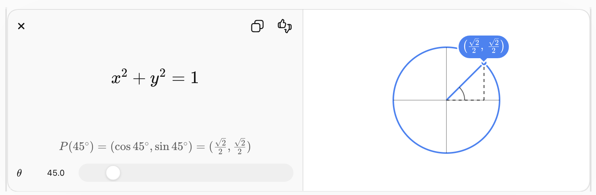
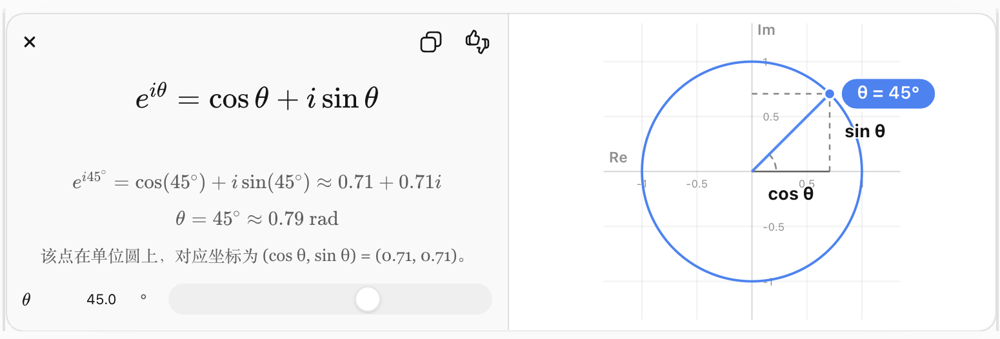
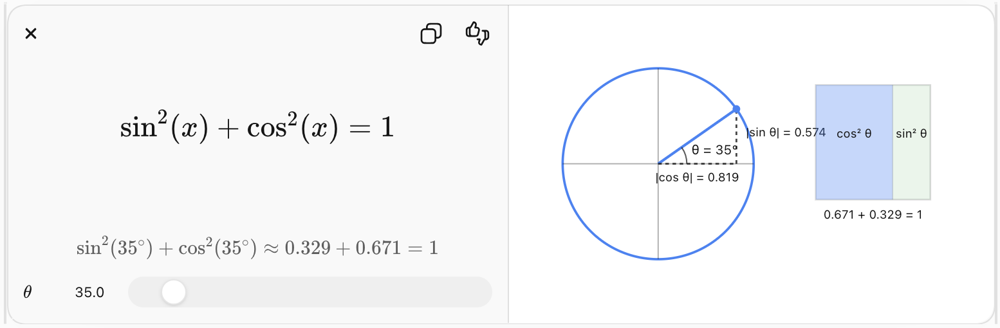

# 学习欧拉公式


欧拉公式（Euler's Formula）是数学中最优美、最重要的公式之一，它把**指数函数、三角函数、复数**联系在一起。

如果你之前已经学习过三角函数，那么学习欧拉公式正是下一步。建议按照下面的顺序学习，而不是直接死记公式。

---

# 学习路线

```
实数
│
├── 代数
│
├── 三角函数
│     ├── 单位圆
│     ├── sin、cos
│     ├── 弧度
│     └── 三角恒等式
│
├── 复数
│     ├── i = √(-1)
│     ├── 复平面
│     └── 复数乘法
│
├── 指数函数
│     ├── e
│     ├── e^x
│     └── 指数的性质
│
└── 欧拉公式
      e^{iθ}=cosθ+i sinθ
```

---

# 第一步：熟悉三角函数（必须）

你至少应该知道：

* 什么是弧度
* 单位圆
* cos 是 x 坐标
* sin 是 y 坐标

例如：

```
θ = 0°

(1,0)

θ = 90°

(0,1)

θ = 180°

(-1,0)
```

单位圆实际上告诉我们：

```
(cosθ, sinθ)
```

就是圆上的一个点。

如果这一点没有理解，欧拉公式几乎无法理解。

---

# 第二步：学习复数

复数长这样：

```
a + bi
```

其中

```
i² = -1
```

例如

```
3 + 2i
-1 + 5i
```

可以把它画到平面上：

```
      Im
       ↑
 3i    ●
       |
-------+--------→ Re
       |
```

所以：

* 横轴是真实数
* 纵轴是虚数

这叫**复平面**。

---

# 第三步：理解复数乘法为什么会旋转

这是欧拉公式最关键的思想。

普通数字乘法：

```
2 × 3 = 6
```

只是放大。

但是复数乘法：

```
(1+i) × z
```

除了放大，

还会**旋转方向**。

所以：

> **复数乘法 = 缩放 + 旋转**

欧拉公式就是把这种旋转写成指数形式。

---

# 第四步：学习指数函数

普通指数：

```
2^3 = 8
```

更一般：

```
e^x
```

其中

```
e ≈ 2.71828
```

它满足

```
e^(a+b)=e^a e^b
```

这是欧拉公式仍然成立的重要原因。

---

# 第五步：理解什么叫复指数

现在提出一个新问题：

> 如果指数不是实数，而是虚数，会发生什么？

例如：

```
e^(iθ)
```

它到底是什么？

欧拉发现：

```math
e^{i\theta}=\cos(\theta)+i\sin(\theta)
```

也就是说，

指数函数突然变成了：

```
实部 = cosθ

虚部 = sinθ
```

这意味着

```
e^(iθ)
```

刚好就是单位圆上的一点。

所以：

```
θ 增加

↓

e^(iθ)
```

就是在单位圆上不断旋转。

---

# 为什么欧拉公式如此神奇？

以前我们知道：

```
(cosθ,sinθ)
```

表示单位圆上的点。

现在发现：

```
e^(iθ)
```

竟然表示同一个点。

于是

```
三角函数
        ↘
         单位圆
        ↗
指数函数
```

完全统一了。

---

# 欧拉恒等式

把

```
θ = π
```

代进去：

```
e^(iπ)
=
cosπ+i sinπ
```

由于

```
cosπ=-1

sinπ=0
```

得到

```
e^(iπ)=-1
```

移项：

```
e^(iπ)+1=0
```

这就是著名的**欧拉恒等式**，它把数学中五个最重要的常数联系在一起：

* (e)：自然对数的底
* (i)：虚数单位
* ($\pi$)：圆周率
* 1
* 0

---

# 欧拉公式是怎么证明出来的？

真正严格的证明通常使用**幂级数（Taylor 展开）**。

将三个函数展开：

```
e^x
```

```
sin x
```

```
cos x
```

然后把

```
x
```

替换成

```
ix
```

整理后就得到欧拉公式。

因此，严格证明需要以下前置知识：

1. 三角函数（尤其是单位圆和弧度）
2. 复数
3. 指数函数
4. 极限
5. 导数
6. 泰勒展开（幂级数）

---

## 推荐的学习顺序

结合你最近一直在学习三角函数，我建议按这个路线推进，每一步都会为下一步打基础：

1. **弧度与单位圆**（确保非常熟悉）
2. **三角恒等式**（和角公式、倍角公式等）
3. **复数与复平面**
4. **复数乘法为什么代表旋转**
5. **自然指数函数 (e^x)**
6. **泰勒展开的基本思想**
7. **欧拉公式**
8. **欧拉恒等式**
9. **欧拉公式在信号处理、傅里叶变换、交流电、量子力学中的应用**

按照这个顺序学习，你会发现欧拉公式不是一个需要死记的公式，而是三角函数、复数和指数函数自然融合的结果。这条路线也正好是学习**傅里叶变换**最经典的数学基础。


# 给初学者解释 复数乘法为什么会旋转

这是学习欧拉公式过程中最容易让人困惑的地方。

很多教材一上来就告诉你：

> **复数乘法 = 旋转 + 缩放**

但初学者通常会问：

> **为什么？为什么乘法突然变成旋转了？**

其实，**旋转并不是人为规定的，而是普通乘法规则自然产生的结果。**

---

# 第一步：先忘记复数

先回忆普通实数。

假设有一条数轴：

```text
<------|------|------|------>

-2     -1     0      1      2
```

如果乘以 2：

```text
1 → 2
2 → 4
3 → 6
```

所有点只是：

* 离原点更远
* 方向不变

所以：

> **实数乘法 = 拉长（缩放）**

---

# 第二步：把数轴变成平面

现在允许数不仅有左右，还有上下。

于是一个数可以写成：

```text
a + bi
```

例如

```text
1 + 2i
```

它就是平面上的一点：

```text
      ↑ Im
      |
  2 ●
      |
------+--------→ Re
      |
```

于是：

**复数 = 平面上的向量**

这是最重要的一步。

---

# 第三步：看看乘以 i 会发生什么

先取一个最简单的点：

```text
1
```

它的位置：

```text
      ↑
      |
------●--------→
      1
```

现在乘以 i：

```text
1 × i = i
```

结果变成：

```text
      ↑
      ● i
      |
------+--------→
```

发现：

**右边变成上边。**

已经旋转了 **90°**。

---

再试一次：

```text
i × i = i² = -1
```

于是

```text
      ↑
      |
●-------------→
-1
```

又旋转了 90°。

---

再乘一次：

```text
-1 × i = -i
```

```text
      |
      |
------+--------→
      |
      ●
```

又转了 90°。

---

最后：

```text
(-i) × i = 1
```

回到起点。

整个过程：

```text
1
↓

i
↓

-1
↓

-i
↓

1
```

就是：

```text
      i
      ↑
      |
-1 ← 0 → 1
      |
      ↓
     -i
```

每次都转了 **90°**。

---

# 为什么一定会旋转 90°？

这不是巧合，我们直接计算。

任意复数：

```text
a+bi
```

乘以 i：

```text
(a+bi)i
```

按照普通乘法展开：

```text
= ai+b i²
```

由于

```text
i²=-1
```

得到：

```text
=-b+ai
```

也就是说

```text
(a,b)

↓

(-b,a)
```

例如

```text
(3,1)

↓

(-1,3)
```

你可以画一下：

原来：

```text
      ●
      |
      |
------+--------
```

后来：

```text
   ●
   |
---+------------
```

是不是正好逆时针转了 90°？

事实上，在二维几何中，把坐标

```text
(x,y)
```

变成

```text
(-y,x)
```

正是**逆时针旋转 90°**的规则。

因此，**乘以 (i) 就等价于逆时针旋转 90°**。

---

# 那乘以一般复数呢？

例如：

```text
1+i
```

不是只有旋转。

它还会放大。

为什么？

因为

```text
1+i
```

距离原点：

```text
√2
```

方向：

```text
45°
```

因此乘以

```text
1+i
```

实际上就是：

* 放大 √2 倍
* 再旋转 45°

一般来说，一个复数都可以写成：

```text
r(cosθ+i sinθ)
```

这里：

* (r) 表示长度
* ($\theta$) 表示方向

当两个复数相乘时：

* 长度相乘：($r_1 \times r_2$)
* 角度相加：($\theta_1 + \theta_2$)

这就是为什么人们说：

> **复数乘法 = 缩放 + 旋转。**

---

# 为什么数学家会发明这样的乘法？

一个更深层的问题是：**为什么要规定 (i^2=-1) 这种乘法规则？**

答案是，他们希望复数乘法仍然保留普通乘法的重要性质：

* 交换律
* 结合律
* 分配律

同时还能表示平面上的方向变化。

令人惊喜的是，只要定义

```text
i² = -1
```

并保持普通代数运算规则，乘法就**自动**具有了旋转效果，并且完美符合二维平面旋转的几何规律。这不是后来额外添加的功能，而是代数规则与几何之间一种深刻的对应关系。

---

## 可以怎样理解它？

对于初学者，一个很有帮助的心智模型是：

* **实数**描述一条数轴上的位置，因此乘法只能改变“距离”，表现为缩放。
* **复数**描述平面上的位置，因此一个数既有“长度”又有“方向”。乘法自然就既会改变长度，也会改变方向，而方向的改变在几何上就是**旋转**。

理解了这一点，再去学习欧拉公式

```math
e^{i\theta}=\cos\theta+i\sin\theta
```

就会发现，它其实是在告诉我们：**指数函数也可以精确地表示这种旋转**。这正是欧拉公式如此优美和重要的原因。


# 感觉复数乘法是复平面的矩阵线性变换


你的感觉是**完全正确的**，而且这是现代线性代数对复数乘法的标准理解。

事实上，可以说：

> **复数乘法就是二维实向量空间上的一种特殊矩阵线性变换。**

下面我们一步一步说明为什么。

---

## 第一步：把复数写成二维向量

一个复数

```math
z=a+bi
```

可以写成二维向量

```math
\begin{bmatrix}
a\\
b
\end{bmatrix}
```

例如

```math
3+2i
```

对应

```math
\begin{bmatrix}
3\\
2
\end{bmatrix}
```

所以复平面，其实就是二维实向量空间 (\mathbb{R}^2)。

---

## 第二步：看看乘以一个固定复数

假设固定一个复数

```math
w=c+di
```

令

```math
z=a+bi
```

计算：

```math
wz=(c+di)(a+bi)
```

展开：

```math
=(ca-db)+(cb+da)i
```

整理成坐标：

```math
\begin{aligned}
x' &= ca-db\\
y' &= da+cb
\end{aligned}
```

写成矩阵：

```math
\begin{bmatrix}
x'\\
y'
\end{bmatrix}
=
\begin{bmatrix}
c&-d\\
d&c
\end{bmatrix}
\begin{bmatrix}
a\\
b
\end{bmatrix}
```

这就是关键结论：

> **乘以固定复数 (c+di)，等价于左乘一个 ($2\times2$) 实矩阵。**

---

## 第三步：举几个例子

### 例1：乘以 i

矩阵变成

```math
\begin{bmatrix}
0&-1\\
1&0
\end{bmatrix}
```

它作用于

```math
\begin{bmatrix}
x\\
y
\end{bmatrix}
```

得到

```math
\begin{bmatrix}
-y\\
x
\end{bmatrix}
```

这正是二维几何中的**逆时针旋转 90°**。

---

### 例2：乘以 2

矩阵变成

```math
\begin{bmatrix}
2&0\\
0&2
\end{bmatrix}
```

就是均匀放大两倍。

---

### 例3：乘以 1+i

矩阵是

```math
\begin{bmatrix}
1&-1\\
1&1
\end{bmatrix}
```

这个矩阵同时完成：

* 放大 ($\sqrt2$) 倍
* 逆时针旋转 ($45^\circ$)

---

## 第四步：为什么只有旋转和缩放？

你可能会问：

> 矩阵还能做剪切（Shear）、拉伸、翻转等各种变换，为什么复数乘法只能做旋转和缩放？

观察矩阵

```math
\begin{bmatrix}
c&-d\\
d&c
\end{bmatrix}
```

它并不是任意矩阵，而是具有特殊形式。

设

```math
r=\sqrt{c^2+d^2}
```

且

```math
c=r\cos\theta,\qquad
d=r\sin\theta
```

那么矩阵可以分解成

```math
r
\begin{bmatrix}
\cos\theta&-\sin\theta\\
\sin\theta&\cos\theta
\end{bmatrix}
```

后面的矩阵就是二维旋转矩阵。

因此整个变换就是：

> **缩放 × 旋转**

不会出现剪切，也不会出现把圆变成椭圆这样的变形。

---

## 第五步：这就是欧拉公式背后的几何意义

欧拉公式告诉我们：

```math
e^{i\theta}
=
\cos\theta+i\sin\theta
```

对应的矩阵正好是

```math
\begin{bmatrix}
\cos\theta&-\sin\theta\\
\sin\theta&\cos\theta
\end{bmatrix}
```

也就是说：

* 在**复数**世界，乘以 ($e^{i\theta}$)；
* 在**线性代数**世界，就是施加一个旋转矩阵。

所以欧拉公式实际上把两种看似不同的描述统一了：

* **代数语言**：乘以一个复数；
* **几何语言**：做一次旋转；
* **线性代数语言**：左乘一个特殊的 ($2\times2$) 矩阵。

---

## 更深一步：为什么很多教材不先讲矩阵？

你的思路其实很接近现代数学。

历史上，复数的研究比矩阵早了几个世纪，因此教材通常按历史发展来讲：先有复数，再有矩阵。

但从理解角度来看，如果已经学过线性代数，那么完全可以反过来理解：

> **复数就是二维平面上一类特殊线性变换的另一种表示方法。**

甚至可以说，复数集合 ($\mathbb{C}$) 与所有形如

```math
\begin{bmatrix}
a&-b\\
b&a
\end{bmatrix}
```

的实矩阵之间存在一一对应关系，并且这种对应不仅保持加法，还保持乘法（称为**代数同构**）。因此，复数既可以看作“二维平面上的点”，也可以看作“对二维平面实施旋转和缩放的线性变换”。这两种观点本质上描述的是同一个数学对象。


# 给初学者解释 欧拉公式

```math
e^{i\theta}
=
\cos\theta+i\sin\theta
```

---

结合我们前面讨论的**"复数乘法 = 矩阵线性变换 = 旋转 + 缩放"**，现在解释欧拉公式就会自然得多。

很多教材会从泰勒展开证明欧拉公式，但对于初学者来说，**先理解它的几何意义，再学习证明**通常更容易。

---

# 第一步：先回忆一个已经理解的事实

我们已经知道：

> **乘以一个固定复数，就是对复平面做一次线性变换。**

例如

乘以

```math
i
```

就是旋转 ($90^\circ$)。

乘以

```math
1+i
```

就是

* 放大 ($\sqrt2$)
* 再旋转 ($45^\circ$)

因此，一个复数实际上包含了两种信息：

* 长度（缩放）
* 方向（旋转）

---

# 第二步：寻找"纯旋转"的复数

现在提出一个问题：

> 有没有一种复数，乘上去以后**只旋转，不放大、不缩小**？

答案当然有。

例如：

```text
1
```

长度是 1。

```text
i
```

长度也是 1。

```text
-1
```

长度也是 1。

这些点都在单位圆上。

单位圆上的所有点都满足：




因此，一个单位圆上的点可以写成

```text
(cosθ,sinθ)
```

对应复数就是

```math
\cos\theta+i\sin\theta
```

例如：

```
θ=0°
↓

1
```

```
θ=90°
↓

i
```

```
θ=180°
↓

-1
```

所以：

> **单位圆上的复数，天然表示"旋转 θ"。**

---

# 第三步：指数函数也具有"连续变化"的特点

再来看另一个完全不同的对象：

指数函数

```math
e^x
```

它有一个重要特点：

如果增加一点点指数：

```
x

↓

x+Δ
```

那么

```math
e^{x+\Delta}
=
e^x,e^\Delta
```

也就是说：

**指数的增加，会不断累积乘法效果。**

---

现在数学家提出一个大胆的问题：

> **如果指数不是实数，而是虚数，会发生什么？**

于是得到

```math
e^{i\theta}
```

这到底代表什么？

---

# 第四步：欧拉发现了惊人的事实

欧拉证明了：



左边：

```
虚数指数
```

右边：

```
单位圆上的复数
```

两者竟然完全一样！

---

# 第五步：这意味着什么？

注意右边

```math
\cos\theta+i\sin\theta
```

它正是：

**单位圆上角度为 θ 的点。**

而单位圆上的点表示：

> **只旋转 θ，不缩放。**

于是：

```math
e^{i\theta}
```

就获得了一个新的几何意义：

> **表示"旋转 θ"这个操作。**

这也是为什么在工程、物理和计算机图形学中，人们经常直接用

```math
e^{i\theta}
```

表示旋转，而不是每次都写

```math
\cos\theta+i\sin\theta
```

---

# 第六步：为什么指数可以表示旋转？

这是欧拉公式最深刻的地方。

以前：

* **加法**表示平移。
* **乘法**表示缩放。

而欧拉公式告诉我们：

**指数还能表示旋转。**

因为

```math
e^{i\theta_1}e^{i\theta_2}
=
e^{i(\theta_1+\theta_2)}
```

左边表示：

```
先旋转 θ₁

再旋转 θ₂
```

右边表示：

```
一次旋转 θ₁+θ₂
```

这与我们对旋转的直觉完全一致：连续旋转两个角度，就等于旋转它们的和。

---

# 第七步：矩阵视角会让欧拉公式更自然

你前面提到：

> **复数乘法感觉就是复平面的矩阵线性变换。**

这个理解非常好。

二维旋转矩阵是

```math
R(\theta)=
\begin{bmatrix}
\cos\theta&-\sin\theta\\
\sin\theta&\cos\theta
\end{bmatrix}
```

而复数

```math
\cos\theta+i\sin\theta
```

对应的矩阵正是

```math
\begin{bmatrix}
\cos\theta&-\sin\theta\\
\sin\theta&\cos\theta
\end{bmatrix}
```

因此：

> **乘以 ($e^{i\theta}$) 与左乘二维旋转矩阵，是同一个几何操作的两种表示方式。**

从这个角度看，欧拉公式并不是在发明一种新的旋转，而是在告诉我们：

> **表示旋转有两种语言：**
>
> * 在线性代数中，用旋转矩阵表示；
> * 在复数中，用 ($e^{i\theta}$) 表示。

欧拉公式正是这两种表示之间的桥梁。

---

## 一个适合初学者记住的总结

学习欧拉公式时，不妨把它理解为下面这条逐步建立起来的逻辑链：

> **复数 → 可以表示平面上的点 → 复数乘法就是旋转和缩放 → 单位圆上的复数表示纯旋转 → 欧拉公式告诉我们：这种纯旋转可以用指数 ($e^{i\theta}$) 来表示。**

等你以后学习泰勒展开时，就会知道**为什么**欧拉公式成立；而现在，先理解它**表示什么**，往往比一开始追求严格证明更重要。


# 解释欧拉公式对应矩阵

```math
\cos\theta+i\sin\theta
```

对应的矩阵是

```math
\begin{bmatrix}
\cos\theta&-\sin\theta\\
\sin\theta&\cos\theta
\end{bmatrix}
```

---


这是一个非常好的问题。

实际上，**这个矩阵不是"猜出来"的，而是由复数乘法直接推导出来的。**

我们一步一步推导，不需要预先知道旋转矩阵。

---

# 第一步：复数就是二维向量

一个复数

```math
z=x+iy
```

对应二维向量

```math
\begin{bmatrix}
x\\
y
\end{bmatrix}
```

现在固定一个复数

```math
w=\cos\theta+i\sin\theta
```

问：

> **乘以这个复数以后，新坐标是多少？**

---

# 第二步：直接做复数乘法

计算

```math
wz
=
(\cos\theta+i\sin\theta)(x+iy)
```

按照普通乘法展开：

```math
=x\cos\theta
+iy\cos\theta
+ix\sin\theta
+i^2y\sin\theta
```

因为

```math
i^2=-1
```

整理得到：

```math

(x\cos\theta-y\sin\theta)
+
i(x\sin\theta+y\cos\theta)
```

于是新的坐标就是：

```math
\begin{aligned}
x'
&=
x\cos\theta-y\sin\theta
\\
y'
&=
x\sin\theta+y\cos\theta
\end{aligned}
```

---

# 第三步：写成矩阵

这两条式子可以写成矩阵形式：

```math
\boxed{
\begin{bmatrix}
x'\\
y'
\end{bmatrix}
=
\begin{bmatrix}
\cos\theta&-\sin\theta\\
\sin\theta&\cos\theta
\end{bmatrix}
\begin{bmatrix}
x\\
y
\end{bmatrix}
}
```

这就是你看到的旋转矩阵。

所以它不是额外定义出来的，而是**复数乘法自然展开后的结果**。

---

# 为什么它恰好是旋转矩阵？

这里有一个更深的问题：

> 为什么这个矩阵刚好就是几何里的旋转矩阵？

我们来验证。

看看矩阵对两个基向量做了什么。

---

## 第一个基向量

把

```math
\begin{bmatrix}
1\\
0
\end{bmatrix}
```

代进去：

得到

```math
\begin{bmatrix}
\cos\theta\\
\sin\theta
\end{bmatrix}
```

这表示：

原来朝着 x 轴，

现在变成了

**角度 θ 的方向。**

---

## 第二个基向量

再代入

```math
\begin{bmatrix}
0\\
1
\end{bmatrix}
```

得到

```math
\begin{bmatrix}
-\sin\theta\\
\cos\theta
\end{bmatrix}
```

注意：

它正好比第一个向量再逆时针旋转 ($90^\circ$)。

所以：

* x 轴旋转了 θ
* y 轴也一起旋转了 θ

整个坐标系保持直角。

因此：

> **整个平面都旋转了 θ。**

---

# 为什么不会剪切（Shear）？

矩阵

```math
\begin{bmatrix}
\cos\theta&-\sin\theta\\
\sin\theta&\cos\theta
\end{bmatrix}
```

有两个特殊性质：

两个列向量分别是

```math
\begin{bmatrix}
\cos\theta\\
\sin\theta
\end{bmatrix}
,
\qquad
\begin{bmatrix}
-\sin\theta\\
\cos\theta
\end{bmatrix}
```

计算它们：

长度：

```math
\sqrt{\cos^2\theta+\sin^2\theta}=1
```

利用恒等式：




内积：

```math
\cos\theta(-\sin\theta)
+
\sin\theta\cos\theta
=
0
```

说明：

* 长度没有改变；
* 两个方向仍然互相垂直。

因此，这个变换不会拉歪、剪切或把圆变成椭圆，只会改变方向——也就是纯旋转。

---

# 一个更高层次的理解

其实有两条推导路线：

### 路线一（代数 → 几何）

1. 定义复数乘法。
2. 展开计算。
3. 得到矩阵

```math
\begin{bmatrix}
a&-b\\
b&a
\end{bmatrix}
```

4. 当 $(a=\cos\theta,\ b=\sin\theta)$ 时，就得到旋转矩阵。

这是我们刚才采用的路线。

---

### 路线二（几何 → 代数）

先从几何知道：

> 旋转一个向量 ((x,y)) 得到

```math
\begin{aligned}
x'&=x\cos\theta-y\sin\theta,\\
y'&=x\sin\theta+y\cos\theta.
\end{aligned}
```

然后把这个二维向量重新写成复数：

```math
x'+iy'
=
(\cos\theta+i\sin\theta)(x+iy)
```

于是发现：

> **旋转矩阵与乘以复数 $(\cos\theta+i\sin\theta)$ 完全等价。**

---

这也是为什么很多数学家认为：

> **复数并不仅仅是平面上的点，它们还可以看成一种特殊的二维线性变换。**

每一个复数 (a+bi) 都对应唯一一个矩阵

```math
\begin{bmatrix}
a&-b\\
b&a
\end{bmatrix},
```

而复数乘法与矩阵乘法完全一致。这种对应关系揭示了复数代数和二维几何之间深刻而优美的联系。
